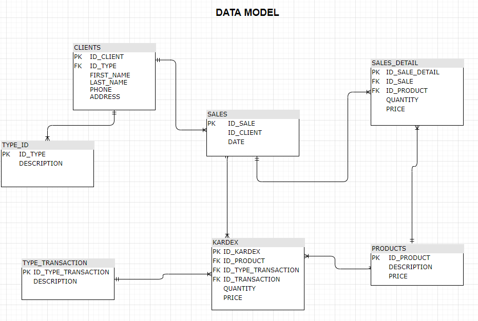
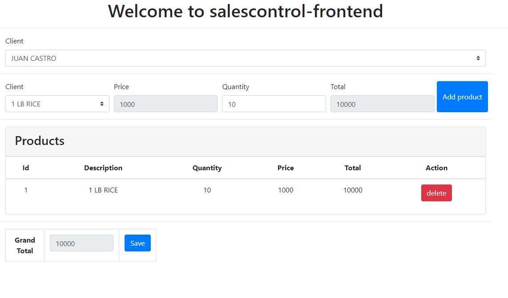

# SpringBoot-BackEnd-Angular-FrontEnd-TechnicalTest
Prueba técnica para validar habilidades de programación con el propósito de aplicar a una vacante de trabajo para el cargo de Analista Implementación de soluciones.

## Enunciado de la prueba técnica

Supermercado Antojitos es un negocio que lleva mas de 10 años en el mercado y se encuentra ubicado en el barrio Vivir Bueno. Este supermercado tiene una gran variedad de productos y el registro de las ventas se lleva de forma manual, generando descuadres y perdida de dinero. La gerencia tiene una gran preocupación porque no tiene control sobre los productos en el supermercado y no puede saber a ciencia cierta si aun quedan unidades de un producto y tampoco del total de ventas realizadas en un día. De acuerdo a lo anterior, la gerencia decidió contratar sus servicios para que desarrolle un aplicativo que se encargue de controlar las ventas que se realizan en el supermercado a diario. Es importante que para cada venta se identifique el cliente que esta comprando los productos del supermercado. Cuando se inicie una venta, el sistema debe solicitar la captura del número de identificación del cliente. Se debe capturar la fecha de la venta que por defecto debe estar asignada al día del
sistema y no la puede modificar, solicitar el producto y las unidades a vender. Cuando se seleccione el producto debe mostrar el valor unitario del producto. En una venta se puede tener mas de un producto registrado, por lo cual es indispensable que el cajero pueda ver todos los productos que ha registrado y tenga el detalle del valor a pagar por cada producto y del total de la venta. Cada vez que se realice una venta se debe disminuir las unidades del producto, pero no se puede permitir vender unidades que no se tienen.

Entregables:
Implementar solución utilizando el modelo de base de datos proporcionado. La solución debe realizarse utilizando como backend JAVA, debe tener consumo de servicios Rest API y el front debe ser implementado en Angular, consumiendo los servicios creados en el backend. Es válido que el front también lo pueden realizar con el framework ICe Faces.

Requisitos:
- Hacer uso de patrones dto o vo para los Request y Response de los servicios creados.
- Usar como ORM – Hiberntate

## Configuración de ambiente

Con el proposito de disminuir la compleja tarea de configuración del ambiente de desarrollo se opto por utilizar la tecnología Spring-boot que permite ejecutar aplicaciones Stand-alone. Aunque, también es posible ejecutar las mismas aplicaciones en entornos web con ciertos ajustes de configuración. A continuación, se describirá la manera como debe ser puesta en funcionamiento.

### Maven

Si usted no ha tenido la oportunidad de haber utilizado una herramienta de software, para la gestión y construcción de proyectos, como Maven no se preocupe para el proposito del proyecto es necesario que tenga en cuenta que debe realizar los siguientes pasos para descargar librerias que el proyecto necesita y para validar que el proyecto no presente ninguna inconsistencia. Luego, de descargar el proyecto, en Eclipse, proceda a realizar las siguientes acciones:

- Descargar librerias: en Eclipse, ubicarse encima de la raíz del proyecto y dar boton derecho, buscar la opción en el menú desplegable, "Maven" y luego seleccionar la opción "Update Project...". En ese instante empezara a descargar las librerias necesarias, tomara unos minutos hacerlo.

- Validar que el proyecto no presente inconsistencias: en Eclipse, ubicarse encima de la raíz del proyecto y dar boton derecho, buscar la opción en el menú desplegable, "Run As" y luego seleccionar la opción "Maven install". Al final, en la consola aparecera un mensaje en mayuscula similar a este: "BUILD SUCCESS" si todo esta correcto.

### Base de datos relacional

Se utilizo la base de datos relacional embebida que ofrece la tecnología Spring-boot con el fin de agilizar el proceso de implementación. Cabe señalar, que esta base de datos es temporal, es decir los datos regresaran al estado original respetando el script inicial de carga, cuando la aplicación nuevamente es desplegada. De acuerdo con las especificaciones técnicas, las instrucciones DDL se incluyen en el archivo schema.sql y las DML en el archivo data.sql, dentro de la carpeta:

`/api/src/main/resources`

El modelo datos definido para la aplicación esta definido en el siguiente modelo entidad relación.

## Iniciar aplicación

### Back-End

Buscar en el proyecto, el archivo:

`com.snacks.salescontrol.SalesControlApplication`

Dar boton derecho encima de este y buscar la opción en el menú desplegable "Run As", luego seleccionar la opción "Java Application". Despues, en la consola de Eclipse usted podra apreciar como un servidor embebido, propio de la tecnología Spring-boot, inicia. Hay que tener en cuenta, que el servidor utiliza por default el puerto 8080, si actualmente lo esta utilizando opte por dejarlo libre o considere cambiar el puerto en el siguiente archivo de propiedades:

`/src/main/resources/application.properties`

Adicione una linea al final, como el ejemplo:

`server.port=8090`

### Front-End

Si usted no esta familiarizado con la tecnología Angular considere ir al siguiente link, en donde se explica como subir el proyecto:

https://github.com/Luisfben/SpringBoot-BackEnd-Angular-FrontEnd-TechnicalTest/tree/master/salescontrol-frontend

## Usar aplicación

#### Para utilizar la aplicación usar la siguiente url:

`http://localhost:4200/`

